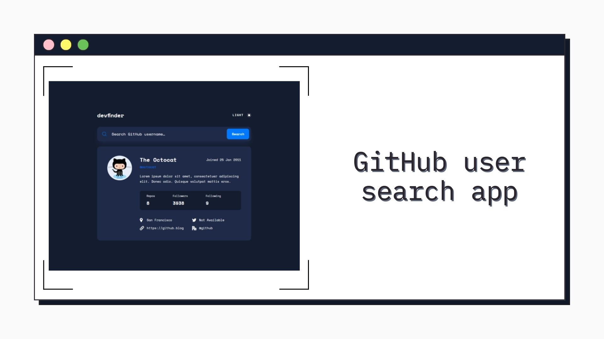

<h1 align="center">GitHub user search app
</h1>

<div align="left">

</div>

&nbsp;



<h2 align="center"> 
	🚧 GitHub user search app 🟢 Completed 🚀 🚧
  
</h2>

&nbsp;

<!--
## Table of contents

- [Project description](#description) - [What I learned](#What-I-learned) -->

<h2 id="#description">Project description 📚</h2>

This is a solution to the challenge
[GitHub user search app](https://www.frontendmentor.io/challenges/github-user-search-app-Q09YOgaH6).

In this project I was able to put into practice the MVC architecture

<a href="https://www.frontendmentor.io/challenges?difficulties=4"></a>

&nbsp;

## What did I put into practice?

- MVC architecture: a pattern of software architecture responsible for contributing to the optimization of speed between requests made by user commands.

&nbsp;

### Model: Business logic, state, API

```js
// State
export const state = {
  users: {},
  darkMode: "",
};

// HTTP/API
const res = await Promise.race([
  fetch(`${API_URL}${query}`),
  timeout(TIMEOUT_API),
]);
```

### Controller: Application logic, is the controller that bridges the gap between Model and View

```js
// Searching for information in the model
await model.searchUserGitHub(query);

// Sending information to the View
resultsView.render(model.state.users);
```

### View: Presentation Logic, what will be shown on the screen to the user

```js

  errorMessage() {
    const markup = `
    <span class="content__results">No results</span>
    `;
    this._parentForm.insertAdjacentHTML("afterbegin", markup);
  }

```

## Links

- [Preview Site](https://vinicius-github-user-search.netlify.app)

&nbsp;

## My process

### Built with

- [HTML](https://developer.mozilla.org/en-US/docs/Web/HTML)
- [CSS](https://developer.mozilla.org/en-US/docs/Web/CSS)
- [Vanilla Js](http://vanilla-js.com)

&nbsp;

## 👨‍💻 Author

- [Frontend Mentor](https://www.frontendmentor.io/profile/viniciusshenri96)
- [Linkedin](https://www.linkedin.com/in/vinícius-henrique-7a2533229/)
